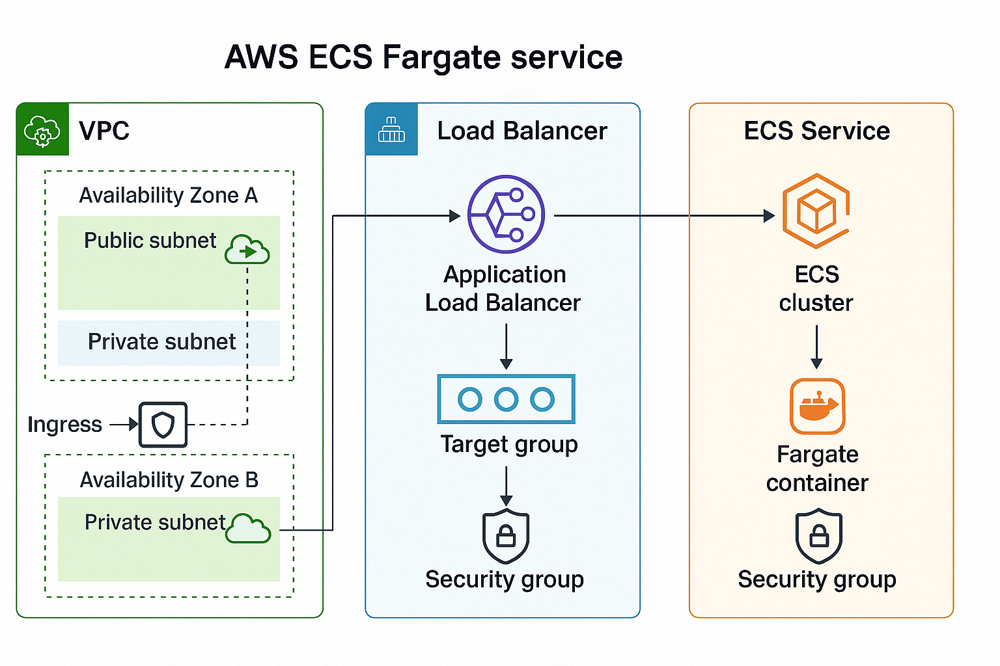
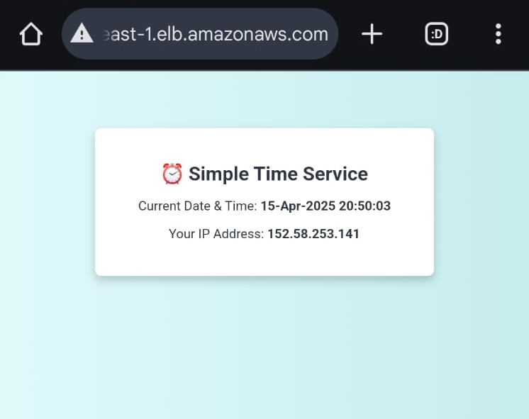

# 🚀 DevOps Sample Project – Containerized App + Terraform Infrastructure

This repository contains a simple Python web application that is containerized using Docker and deployed through CI/CD pipelines. The infrastructure is provisioned using Terraform, making it a complete example of modern DevOps practices.

---

## 📁 Repository Structure

```
├── app/                    # Python web app source code
│   ├── main.py
│   ├── requirements.txt
│   ├── Dockerfile
│   └── templates/
├── terraform/              # Terraform infrastructure as code
│   ├── backend.tf
│   ├── main.tf
│   ├── outputs.tf
│   ├── provider.tf
│   ├── variables.tf
│   └── *.tfvars
├── .github/workflows/      # GitHub Actions CI/CD pipeline
│   └── ci-cd.yml
├── aws_sts_assume_role.py  # AWS credentials script (assume role)
└── README.md
```

---

## ✅ Prerequisites

Before you begin, ensure you have the following installed:

- [Docker](https://docs.docker.com/get-docker/)
- [Python 3.8+](https://www.python.org/downloads/)
- [Terraform v1.4+](https://developer.hashicorp.com/terraform/downloads)
- [AWS CLI](https://docs.aws.amazon.com/cli/latest/userguide/install-cliv2.html)
- [Git](https://git-scm.com/downloads)

---

## 🔐 AWS Credentials Setup

To authenticate with AWS, you can either:

### Option 1: Use Default AWS Profile

```bash
aws configure
```

### Option 2: Assume Role using `aws_sts_assume_role.py`

Update the script with your role ARN and run:

```bash
python aws_sts_assume_role.py
```

---

## 🐳 Docker – Running the App Locally

### 1. Navigate to the App Directory

```bash
cd app
```

### 2. Build the Docker Image

```bash
docker build -t simple-app:latest .
```

### 3. Run the Container

```bash
docker run -p 5000:5000 simple-app:latest
```

Now visit [http://localhost:5000](http://localhost:5000)

---

## 🌍 Terraform – Deploying Infrastructure [use the exact command]

### 1. Navigate to the Terraform Directory

```bash
cd terraform
```

### 2. Initialize Terraform

```bash
terraform init -backend-config="backend.develoment.conf"
```

### 3. Plan the Deployment

```bash
terraform plan -var-file="terraform.develoment.tfvars"
```

### 4. Apply the Infrastructure

```bash
terraform apply -var-file="terraform.develoment.tfvars"
```

> 💡 Make sure your AWS credentials are configured before running the above.

---

## ⚙️ GitHub Actions – CI/CD Pipeline

This repository includes a CI/CD pipeline using GitHub Actions (`.github/workflows/ci-cd.yml`) that automates testing, building, and deploying the container.

To trigger it:

1. Push changes to the repository.
2. GitHub will automatically run the workflow.

---

## 🧼 Cleanup

To destroy the infrastructure:

```bash
terraform destroy -var-file="terraform.develoment.tfvars"
```

---

## 🙌 Support & Contributions

If you're stuck or want to improve this, feel free to open an issue or pull request.

---

**Happy shipping! 🚢**


## 🧭 Solution Architecture


## 🖼️ Project Landing Page

